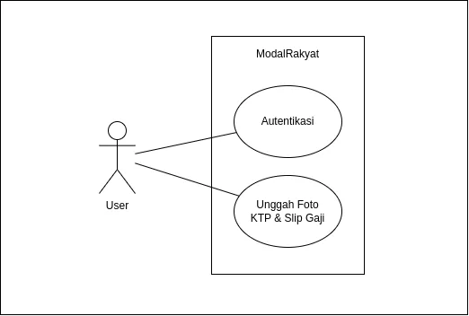

## Specification

### Sistem Unggah Dokumen Aman
- Sebuah aplikasi Fintech (misal P2P Lending) "ModalRakyat"
mengharuskan pengguna baru mengunggah foto KTP dan Slip Gaji
untuk verifikasi (proses Know Your Customer). Proses ini harus
super aman.

#### Data Stream (In-Transit)
- Proses Unggah (Upload): Amankan proses file upload (HTTP POST) dari
aplikasi mobile/web ke backend..
- Pemisahan Aliran Data: Saat file diterima backend, file harus divalidasi
(tipe, ukuran) dan metadata (e.g., "User A upload KTP") dikirim ke
database, sementara file-nya sendiri dikirim ke storage serta amankan
aliran data

#### Data at Rest
- Penyimpanan File Sensitif (KTP): Ini adalah inti tugasnya. Simpan file KTP
di object Implementasikan Enkripsi Sisi Server
- Kontrol Akses: Buktikan bahwa file KTP tersebut tidak bisa diakses
publik), dan hanya bisa diakses oleh layanan internal yang memiliki
credential khusus.

## Usecase

## LICENSE
This project is licensed under the GNU Affero General Public License v3.0
License - see the [LICENSE](LICENSE) file for details.
